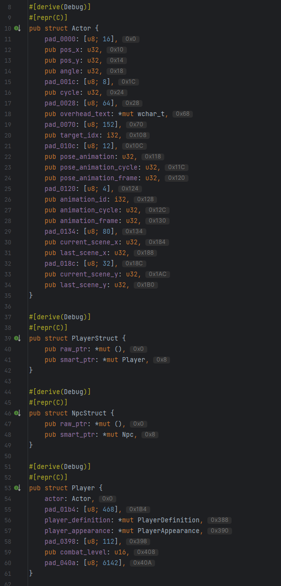

# offsets-rs
A very simple Rustlang IntelliJ plugin/extensions used to display field offsets as inlay hints in .rs files.

May come in handy when reverse engineering.

## Pre-requisites
This plugin requires the official IntelliJ Rust plugin to be installed.

## Limitations
The plugin takes custom types/structs into account when calculating, but if they are referenced from other files, the files containing the custom type needs to be opened first in order for the plugin to calculate and remember the size of this type. An example is shown below in the `Player` struct, which uses the `Actor` type of size `1B0`.

## Showcase

